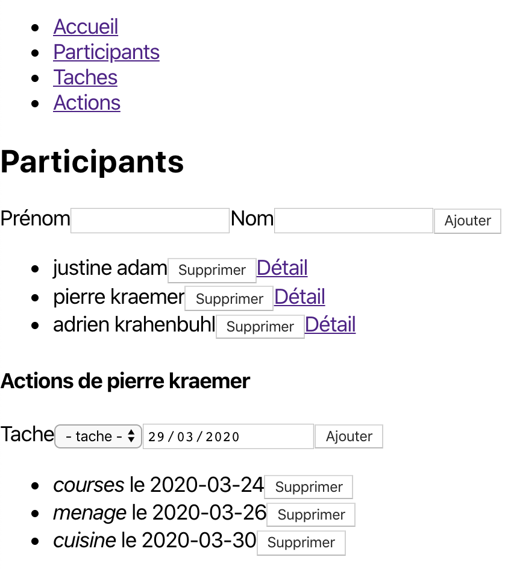

# W4a / W4b - TP noté

>Prenez le temps de bien lire l'ensemble du sujet avant de vous lancer..

>Les parties serveur et client seront évaluées séparément, répartissez correctement votre temps entre les deux aspects. N'hésitez pas à abandonner une fonctionnalité sur laquelle vous coincez, quitte à proposer une solution simplifiée par rapport à ce qui est demandé dans le sujet.

On souhaite construire une application qui permet de suivre la répartition de tâches au sein d'un groupe de participants.
L'application permet de gérer la liste des participants, la liste des différentes tâches qu'il est possible d'effectuer et bien sûr de saisir des actions, c'est-à-dire le fait qu'un participant réalise une tâche à une date donnée.
Chaque tâche ayant une valeur associée, le total actuel de points de chaque participant permet d'avoir une idée de l'équité de la répartition des tâches dans le groupe au fil du temps.

Vous êtes en charge du développement de cette application en respectant les contraintes suivantes :
 - Les données sont stockées dans une base de données relationnelle __MySQL__
 - Une API HTTP développée en __Node.js__ avec __Express__ et __Sequelize__ expose des routes permettant d'accéder et de manipuler ces données
 - Une application web développée avec la bibliothèque __React__ présente une interface utilisateur qui dialogue avec cette API

<hr />

Modèle de données
=================

Les différentes entités sont les suivantes :
 - `Participant` :
   - `prenom` : prénom du participant
   - `nom` : nom du participant
 - `Tache` :
   - `intitule` : intitulé de la tâche
   - `valeur` : valeur de la tâche
 - `Action` :
   - `date` : date de la réalisation

Les relations entre ces entités sont les suivantes :
 - une `Action` _appartient à_ un `Participant`
 - une `Action` _appartient à_ une `Tache`
 - un `Participant` _a plusieurs_ `Action`
 - une `Tache` _a plusieurs_ `Action`

La suppression d'un `Participant` ou d'une `Tache` entraîne la suppression des `Action` associées.

<hr />

API HTTP
========

Vous devez créer l'API HTTP qui permet de lire et de manipuler les données correspondant au modèle de données décrit ci-dessus.
Un certain nombre de routes seront nécessaire au bon fonctionnement du client.
À vous de déterminer les routes dont votre application a besoin.
N'en écrivez pas plus que nécessaire.

Indications
-----------

>__Le code de l'API doit être écrit dans le dossier `server`.__
>__Vous pouvez partir de la structure proposée (similaire à celle des TP précédents).__

>__N'oubliez pas de modifier les informations de connexion à la base de données dans le fichier `models/index.js`.__
>__N'oubliez pas également de faire un `npm install` dans ce dossier pour récupérer les dépendances.__

 * Clés étrangères

Comme il pourra être utile, dans le code client, de se servir du nom des attributs clés étrangères qui seront générés dans le modèle `Action` pour faire référence à un `Participant` et à une `Tache`, il est possible de déterminer le nom de ces attributs dans notre code plutôt que de laisser Sequelize choisir un nom tout seul. Par exemple, en déclarant la relation "un `Participant` _a plusieurs_ `Action`" de la manière suivante :
```js
Participant.hasMany(db.Action, { foreignKey: 'ParticipantId', onDelete: 'cascade' });
```
on déclare que l'on souhaite que la clé étrangère ajoutée dans le modèle `Action` pour faire référence à `Participant` s'appelle ici `ParticipantId`.

 * Dates

Le type de la propriété `date` du modèle `Action` doit être déclaré comme un type Sequelize `DATEONLY`. Les dates seront alors stockées sous la forme "2020-03-30".

<hr />

Client web
==========

L'interface doit afficher un menu pour accéder à des interfaces qui permettent de :

 - gérer les `Participant`
   - liste des `Participant`
   - création d'un `Participant`
   - suppression d'un `Participant`

><a href="./img/1_participants.png"></a>

 - gérer les `Tache`
   - liste des `Tache`
   - création d'une `Tache`
   - suppression d'une `Tache`

><a href="./img/2_taches.png"></a>

 - gérer les `Action`
   - liste des `Action`
   - création d'une `Action`
   - suppression d'une `Action`

><a href="./img/3_actions.png"></a>

En plus d'afficher l'ensemble de toutes les actions effectuées dans la partie __Actions__ de l'application, ajoutez un lien `Détails` à côté de chaque `Participant` dans la partie __Participants__ de l'application.
Un clic sur ce lien affiche la liste des `Action` effectuées par ce `Participant` et permet également de lui en ajouter et d'en supprimer.

><a href="./img/2_taches.png"></a>

Indications
-----------

>__Le code de l'application client doit être écrit dans un dossier `client`.__
>__Le plus simple est probablement d'initialiser ce dossier avec la commande `npx create-react-app client`.__

>Les captures d'écran montrées dans le sujet sont très basiques.
>Vous avez toute liberté pour la partie graphisme et ergonomie de votre interface.
>Vous pouvez utiliser des bibliothèques de composants telles que Material-UI, React Bootstrap, Semantic UI React, ...

* Combobox

Pour faire des combobox avec __React__ (par exemple pour sélectionner un `Participant` ou une `Tache`) :
```js
<select value={selectedValue} onChange={e => setSelectedValue(e.target.value)}>
    <option value={1}> texte 1 </option>
    <option value={2}> texte 2 </option>
</select>
```
Dans cet exemple, `selectedValue` et `setSelectedValue` proviennent d'un `useState`. Dans la fonction `onChange`, `e.target.value` vaut la valeur donnée à la propriété `value` de l'option sélectionnée. L'ensemble des éléments `option` peut bien sûr être généré à partir d'un tableau d'objets avec un appel à `map`.

* Dates

Les éléments `input` de type `date` permettent de saisir des dates. Quelle que soit la manière d'afficher cette date dans l'interface (en fonction de la locale), leur valeur est une chaîne de la forme "2020-03-30". L'élément de `state` qui va contrôler la valeur de cet `input` sera donc une chaîne à ce format. Vous pouvez soit initialiser cette valeur "à la main", soit utiliser la fonction `format` fournie par la bibliothèque `date-fns` (`npm install --save date-fns`) :
```js
import format from 'date-fns/format';

...

const [date, setDate] = useState('2020-03-30'); // à la main
const [date, setDate] = useState(format(new Date(), 'yyyy-MM-dd')); // date courante avec format

...

<input type="date" value={date} onChange={e => setDate(e.target.value)} />
```

Pour l'envoi de données vers l'API, rien de spécial à faire, puisque c'est justement à ce format que notre modèle de données représente les dates.
